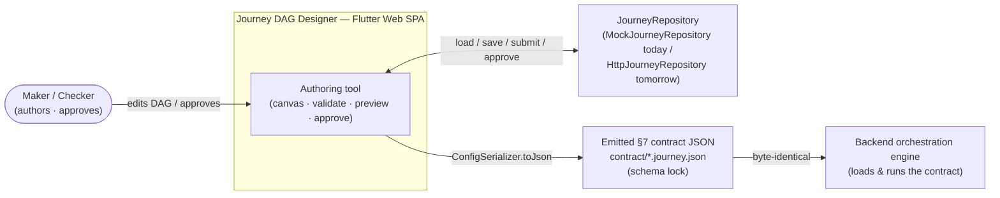
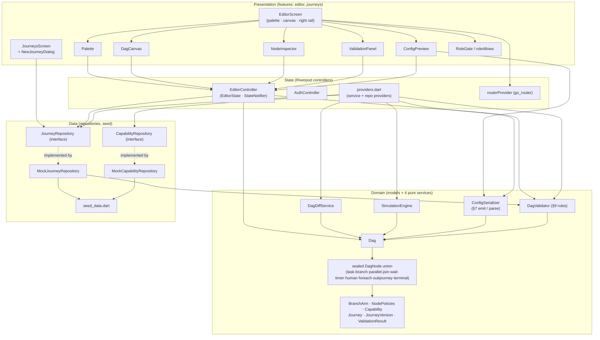
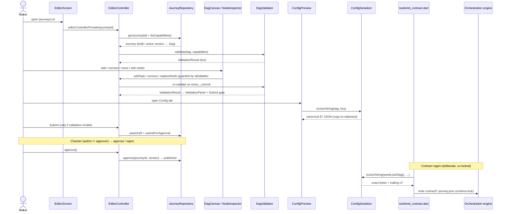

# Journey DAG Designer — Architecture

> **Repo:** `journey-dag-designer` · **Type:** Flutter Web SPA (Riverpod · freezed · go_router) · **Runtime:** Dart / Flutter Web

## 1. Purpose & Context

The Journey DAG Designer is a **config-not-code** authoring tool: a maker visually composes a journey as a DAG on a canvas, and the app emits the **shared §7 contract JSON** that the backend orchestration engine loads and runs. It never executes journeys itself — it authors, validates, and serializes them. The contract is **schema-locked**: the JSON that `ConfigSerializer` emits is byte-identical to the resource the engine consumes, a guarantee proven by a round-trip / contract-lock test (`tool/emit_contract.dart` → `contract/*.journey.json`). Authoring is governed by a **maker-checker** lifecycle (`draft → pendingApproval → published | rejected`), with `author != approver` enforced in the UI (`RoleGate`) and again by the backend (403). The client mirrors the engine's publish-time validator (`DagValidator`) so errors surface live, but the engine re-validates authoritatively.

## 2. High-Level Block Diagram



## 3. Low-Level Block Diagram



## 4. Flow Diagram



## 5. Key Files

### Domain models (`lib/domain/models`)
| File | Role |
| --- | --- |
| `dag.dart` | `Dag` value type: `startNodeId`, `nodes`, named backpressure `pools`, `contextSchemaRef`, Designer-only `layout`. |
| `dag_node.dart` | `sealed DagNode` union of **10** node types (task, branch, parallel, join, wait, timer, human, foreach, subjourney, terminal) + `successors` / `typeName`. |
| `node_policies.dart` | `NodePolicies` (retry/timeout/circuitBreaker/meter), `Compensation`, `PoolSpec` — the §3/§4/§7 declarative constraints. |
| `branch_arm.dart` | `BranchArm` (`when` → `next`) and `HumanOutcome` (`value` → `next`). |
| `capability.dart` | `Capability` palette item; `key` == backend module name; `isMoneyOrBookingNode` drives the saga rule. |
| `journey.dart` | `Journey` + `JourneyVersion` aggregate, `ApprovalStatus` maker-checker lifecycle. |
| `validation.dart` | `ValidationResult` / `ValidationIssue` / `ValidationCode` — the shared rule vocabulary; `isValid` gates Submit. |

### Domain services (`lib/domain/services`) — pure, framework-free, unit-tested
| File | Role |
| --- | --- |
| `config_serializer.dart` | `ConfigSerializer` — single source of §7 emit (`toJson`/`toJsonString`) and parse (`fromJson`); the shared contract. |
| `dag_validator.dart` | `DagValidator` — §9 rules (reachability, time-gated cycles, dangling edges, branch default, join predecessors, saga compensation, wait timeout, capability registry). |
| `dag_diff_service.dart` | `DagDiffService` — pure structural node/edge diff for the version-diff view (layout ignored). |
| `simulation_engine.dart` | `SimulationEngine` — deterministic preview planner (ready-set / parallel groups / compensation path); never a second engine. |

### State (`lib/app`, `lib/features/editor`, `lib/core/auth`)
| File | Role |
| --- | --- |
| `features/editor/editor_controller.dart` | `EditorController` + `EditorState` (StateNotifier): edits, `isEditable` gating, re-validation on commit, maker-checker persistence. |
| `app/providers.dart` | Riverpod DI: service singletons + repository providers (default to seeded mocks). |
| `app/router.dart` | `routerProvider` go_router config with auth redirect guard. |
| `core/auth/auth_controller.dart` | `AuthController` / `AuthState` — current `AppUser` + roles. |

### Presentation (`lib/features`)
| File | Role |
| --- | --- |
| `features/editor/editor_screen.dart` | `EditorScreen` — palette + canvas + tabbed right rail; top-bar lifecycle actions + version selector. |
| `features/editor/widgets/dag_canvas.dart` | `DagCanvas` — pan/zoom node canvas, edge painter, drag-move, click-to-connect. |
| `features/editor/widgets/node_inspector.dart` | `NodeInspector` — type-specific config forms → `replaceNode`. |
| `features/editor/widgets/palette.dart` | `Palette` — capability list (registry-only) + structural node buttons. |
| `features/editor/widgets/validation_panel.dart` | `ValidationPanel` — live `DagValidator` issues, tap-to-focus. |
| `features/editor/widgets/config_preview.dart` | `ConfigPreview` — canonical `ConfigSerializer.toJsonString` output + copy. |
| `features/journeys/journeys_screen.dart` | `JourneysScreen` + `NewJourneyDialog` — registry list, scope filters, create. |
| `core/auth/role_gate.dart` | `RoleGate` / `roleAllows` — role-based visibility/enablement. |

### Data (`lib/data`, `lib/domain/repositories`)
| File | Role |
| --- | --- |
| `domain/repositories/journey_repository.dart` | `JourneyRepository` abstract interface (mock today, Http tomorrow). |
| `data/repositories/mock_journey_repository.dart` | `MockJourneyRepository` — in-memory seeded registry + lifecycle mutations. |
| `data/repositories/mock_capability_repository.dart` | `MockCapabilityRepository` — seeded capability registry. |
| `data/seed_data.dart` | `seedCapabilities` + `seedLoanDag` / `seedPaymentDag` / `seedAutopaySetupDag` / `seedCancelDag` and journeys. |

### Tooling & tests (`tool`, `test`)
| File | Role |
| --- | --- |
| `tool/emit_contract.dart` | Emits the shared `contract/*.journey.json` fixtures via the real `ConfigSerializer`. |
| `test/contract/contract_lock_test.dart` | Schema-lock test: fixture exists, no code drift, byte-for-byte round-trip, real capability keys. |
| `test/domain/config_serializer_test.dart` | Round-trip / emit unit tests for `ConfigSerializer`. |
| `test/domain/dag_validator_test.dart` | §9 rule coverage for `DagValidator`. |
| `test/domain/dag_diff_service_test.dart`, `simulation_engine_test.dart` | Diff + simulation service tests. |
| `test/features/editor_controller_test.dart` | `EditorController` edit / lifecycle tests. |

## 6. The Schema Lock

The emitted §7 JSON is the **shared contract** between this app and the orchestration engine — they must agree byte-for-byte. Three pieces keep it locked:

1. **One serializer, hand-emitted.** `ConfigSerializer.toJson` (in `lib/domain/services/config_serializer.dart`) is the single source of the wire shape: field order, array order, and the `JsonEncoder.withIndent('  ')` formatting are *the contract* and must not be reordered lightly. Its round-trip invariant is `fromJson(toJson(dag)) == dag`.
2. **The committed fixtures.** `tool/emit_contract.dart` runs the *real* serializer over the seed DAGs (`seedLoanDag()`, etc.) and writes the exact bytes (serializer output **+ trailing LF**) to `contract/loan-origination.journey.json`, `contract/payment-execution.journey.json`, `contract/emandate-autopay-setup.journey.json`, and `contract/emandate-cancel.journey.json`. These files are the authoritative schema artifact the engine loader consumes.
3. **The lock test.** `test/contract/contract_lock_test.dart` asserts: the fixture exists; the canonical journey still emits the committed contract (`file.readAsStringSync() == contractContents()` — no code drift); `ConfigSerializer` round-trips the fixture byte-for-byte (`reEmitted == raw`); and the contract carries the real backend capability keys (`scoring`, `customer-party`, `kyc`, `bureau`, `lending-origination`). Any divergence turns this test red on the frontend (and the engine's loader test red in lockstep). Regenerate **only** as a deliberate, co-locked schema change:

```bash
dart run tool/emit_contract.dart
```

## 7. Build & Run

This environment needs the Flutter and Dart SDKs on `PATH`:

```bash
export PATH="/opt/flutter/bin:/opt/dart-sdk/bin:$PATH"
```

```bash
# 1. Dependencies
flutter pub get

# 2. Codegen (freezed *.freezed.dart, riverpod, json_serializable)
dart run build_runner build --delete-conflicting-outputs
#   or, while iterating:
dart run build_runner watch --delete-conflicting-outputs

# 3. Static analysis (analysis_options.yaml / flutter_lints)
flutter analyze

# 4. Tests (pure domain services + contract lock + editor controller)
flutter test

# 5. Run the web app
flutter run -d chrome
#   production build:
flutter build web

# 6. Regenerate the shared §7 contract fixtures (deliberate, co-locked only)
dart run tool/emit_contract.dart
```
